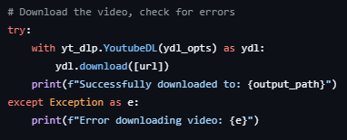

# YouTube Video Downloader
I've been juggling different websites to download YouTube videos since I was 11, but they would only last a few months before either getting taken down or becoming riddled with ads and malware.
This problem became especially clear to me when I was recently struggling to download a 2-hour concert of one of my favourite bands, Yorushika. There aren't any free websites that offer video downloads longer
than an hour, and I was scared that the video would get taken down soon. This is when I realized that my previous project of making a Discord Music Bot lightly touched on the technology needed for this.
After working on my previous project of making a Discord Music Bot, I realized that I could just use yt-dlp to make a dedicated video downloader myself!

# Process, Debugging, and Optimizations
**Tech used:** Python, yt-dlp

Thankfully, I knew this project would be relatively easy since I would only have to make use of one of the main functionalities of yt-dlp. I started by making a function called `download_video` that takes
the parameters `url` and `output_path`. After receiving user input that contains the link to the video they wish to download, the function is called, which first retrieves the specified download settings. This is where I
experienced my first hiccup, since by default, yt-dlp will try to download all the videos on the page instead of just the target video, which can lead to ridiculous download sizes. However, I later discovered that yt-dlp
has a built-in setting you can add called `noplaylist`, which, when set to True, only downloads the selected video. After reading the settings, the program proceeds to the downloading section.

The actual 'downloading' part was quite simple, as I simply had to use the built-in `ydl.download()` function. I made sure to include this process in a try-except block to handle exceptions, since they can be quite common when invalid
links are provided.

**Try-Except Block:**

Originally, the script had to be opened and a URL had to be pasted into a `URL` variable, but I realized that this was impractical and decided to feed user input into the variable instead.
This not only helps improve the ergonomics of using the program, but also makes it easier to someday create a GUI for improved functionality.

# Takeaways
Working on this project made me realize that it might be easier than I thought to create solutions to problems myself, even if there are solutions out there that work, but don't quite fit my needs. I've since been considering
problems that I face or previously faced that I might be able to solve on my own, or by adapting a pre-existing technology, like in this instance.

